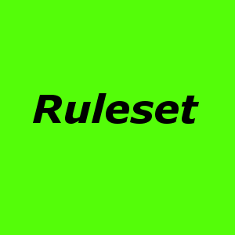

# Controlling Devices with Rules


[](https://travis-ci.org/schmupu/ioBroker.devicectrl)
[](https://ci.appveyor.com/project/schmupu/ioBroker-devicectrl/)
  [](https://www.npmjs.com/package/iobroker.devicectrl)
[](https://www.npmjs.com/package/iobroker.devicectrl)

[](https://nodei.co/npm/iobroker.devicectrl/)

You can control devices by a set of rules. For example you turn on a light, switch or change the temperature to a given time or on sunrise or sundown at your place. Also you can change the state of the devices depending of a state of other devices. For example, turn on a light, if the alarm system is arm between 6 am and 8 am and 8 pm and 10 pm.

## Install & Configuration
In the moment you have to do the configuration by script. You have to do start the configuration script only if you add a new rule or change an existing rule.

The configuration ist not very complicated but not very user friendly in the moment. 


For every rule you have to create an object like this.
```
let kitchenLight = {

  rulename: "Kitchen Light",    // name of rule
  active: true,                 // rule acitve

  time:   [ /* ... */ ],
  state:  [ /* ... */ ],
  rule:   [ /* ... */ ]

}
```
For adding or changing rules you have do following: 
```
// add rule kitchenLight 
sendTo("devicectrl.0", "add", kitchenLight, (result) => {
  console.log(result);
});

// add rule livingRoomLight
sendTo("devicectrl.0", "add", livingRoomLight, (result) => {
  console.log(result);
});

// save rule kitchenLight and livingRoomLight to all existing rules. 
// After saving, the adapter restarts and the rule is active.
// In the ioBroker Logfile you see errors if one exist. 
sendTo("devicectrl.0", "save", "", (result) => {
  console.log(result);
});
```
If you want to delete a rule you deactivate a rule by setting in the rule object the active flag to false or you delete the rule.
For deleting a rule you to do following:
```
// Deleting rule you call delete by adding the rulename. 
// Deleting rule "Kitchen Light"
sendTo("devicectrl.0", "delete", "Kitchen Light", (result) => {
  console.log("Delete: " + result);
});

// With Asterisk (*) you delete all rules
sendTo("devicectrl.0", "delete", "*", (result) => {
  console.log("Delete: " + result);
});
```

### Explanation of the rule object
Detailed explanation of the rule object.
```
let kitchenLight = {

  rulename: "Kitchen Light",    // name of rule
  active: true,                 // rule acitve

  time:   [ /* ... */ ],
  state:  [ /* ... */ ],
  rule:   [ /* ... */ ]

}
```

**Rule name and Active flag**

```
let kitchenLight = {
  rulename: "Kitchen Light",    // name of rule
  active: true,                 // rule acitve
  /* ... */
}
```
*rulename*:   
the name of rule (string).

*active*:     
if rule shall be active or inactive (boolean) 

**Time**
```
let kitchenLight = {
  /* ... */
  time: [ 
    { name: "t1", 
      from: "06:30", 
      to: "22:00", 
      weekday: "So" 
    }
    { name: "t2", 
      from: "06:00,06:30", 
      rangefrom: "06:15,06:20", 
      to: "23:00", 
      weekday: "Fr"
    },
    { name: "t3", 
      from: "06:30", 
      to: "22:00", 
      weekday: "So" 
    }
    { name: "t4", 
      from: "sunreise-02:00,09:00",
      to: "05:00,05:15",  
      range: "06:00,09:00", 
      weekday: "Mo,Di,Mi,Do,Fr", 
    },
  ],
  /* ... */
}
```
The property time of a rule is an array of objects. Every object of this array can have following properties:


*name*:  
Name of this time object

*from*:  
The property from can have following format
* "HH:MM":  valid from HH:MM. For example "14:00"
* "HH:MM,hh:mm": A random time between "HH:MM" and "hh:mm". For example, if you enter "14:00,15:00", from will be "14:34" or "14:59"
* "sunrise" or "sunset": placeholder for the sunrise or sunset time at your place.
* "sunrise,12:00": A random time between sunrise and 12:00 at your place. For example, the sunrise is at 6:15, you get back an random time between 6:15 and 12:00 like 10:13.
* "19:00,sunset": A random time between 19:00 and sunset at your place. For example, the sunset is at 19:15, you get back an random time between 19:00 and 19:15 like 19:13.
* "sunset-02:00,sunset+02:00": A random time between sunset minus 2 hours and sunset plus 2 hours at your place. For example, the sunset is at 19:15, you get back an random time between 17:15 and 21:15 like 20:13.

*to*:  
The property to can have following format
* "HH:MM":  valid till HH:MM. For example "14:00"
* "HH:MM,hh:mm": A random time between "HH:MM" and "hh:mm". For example, if you enter "14:00,15:00", from will be "14:34" or "14:59"
* "sunrise" or "sunset": placeholder for the sunrise or sunset time at your place.
* "sunrise,12:00": A random time between sunrise and 12:00 at your place. For example, the sunrise is at 6:15, you get back an random time between 6:15 and 12:00 like 10:13.
* "19:00,sunset": A random time between 19:00 and sunset at your place. For example, the sunset is at 19:15, you get back an random time between 19:00 and 19:15 like 19:13.
* "sunset-02:00,sunset+02:00": A random time between sunset minus 2 hours and sunset plus 2 hours at your place. For example, the sunset is at 19:15, you get back an random time between 17:15 and 21:15 like 20:13.

*range*:  
* "HH:MM,hh:mm": The object is only valid if the time in to and from is between the range "HH:MM" and "hh:mm". For example you would like to turn on the light outside your house always between sunrise and 9:00 but never before 6:00 you can add an range like this "06:00,09:00", from "sunrise" and to "09:00". Instead of "HH:MM" or "hh:mm" you can use "sunrise" or "sunset")

*duration*:  
You can use duration with the property *from* or *to*. If *from* is "HH:MM" and duration is "hh:mm" or "-hh:mm" than the time will go from  "HH:MM" to "HH:MM" + "hh:mm" or "HH:MM" + "-hh:mm". For example: *from* is "15:00" and duration is "03:00" than it will go from 15:00 to 18:00. 

*weekday* (optional):  
You can enter a weekday the object is valid. Weekday can be Sa,So,Mo,Di,Mi,Do,Fr. If you leave it empty, every weekday is valid. You can enter numerous weekday with comma separated. 
Example: "Mo" or "Mo,Di" or "Mo,Sa,So"
Holidays will be equalized with Sunday. For example, today is Wednesday and New Year, than the object is only valid if weekday comprise Sunday.


**State**

**Rule**
```
let kitchenLight = {
  /* ... */
   rule: [
        { name: "r0", query: "t0.v", id: idLEDKetteWeiss, delay: '00:01:00,00:02:30', value: true },
        { name: "r1", query: "t0.v && l.v <= 180 && e.v == false", id: idLEDKetteWeiss, value: true },
        { name: "r2", query: "t0.v && l.v >= 9 && e.v == true", id: idLEDKetteWeiss, value: false },
        { name: "r3", query: "!t0.v", id: idLEDKetteWeiss, value: false }
    ]
  /* ... */
}
```

*delay*  
The time before changing the state of a rule. Delay can be specified in following format: "HH:MM:SS" (fixed delay time) or "HH:MM:SS,hh:mm:ss" (random delay time between HH:MM:SS and hh:mm:ss)   

## Changelog
### 0.1.4 (21.01.2019)
* (Stübi) delete old functions

### 0.1.3 (23.11.2018)
* (Stübi) changed to async functions

### 0.1.2 (23.11.2018)
* (Stübi) First Version


## License
The MIT License (MIT)

Copyright (c) 2018-2019 Thorsten <thorsten@stueben.de> / <https://github.com/schmupu>

Permission is hereby granted, free of charge, to any person obtaining a copy
of this software and associated documentation files (the "Software"), to deal
in the Software without restriction, including without limitation the rights
to use, copy, modify, merge, publish, distribute, sublicense, and/or sell
copies of the Software, and to permit persons to whom the Software is
furnished to do so, subject to the following conditions:

The above copyright notice and this permission notice shall be included in
all copies or substantial portions of the Software.

THE SOFTWARE IS PROVIDED "AS IS", WITHOUT WARRANTY OF ANY KIND, EXPRESS OR
IMPLIED, INCLUDING BUT NOT LIMITED TO THE WARRANTIES OF MERCHANTABILITY,
FITNESS FOR A PARTICULAR PURPOSE AND NONINFRINGEMENT. IN NO EVENT SHALL THE
AUTHORS OR COPYRIGHT HOLDERS BE LIABLE FOR ANY CLAIM, DAMAGES OR OTHER
LIABILITY, WHETHER IN AN ACTION OF CONTRACT, TORT OR OTHERWISE, ARISING FROM,
OUT OF OR IN CONNECTION WITH THE SOFTWARE OR THE USE OR OTHER DEALINGS IN
THE SOFTWARE.
